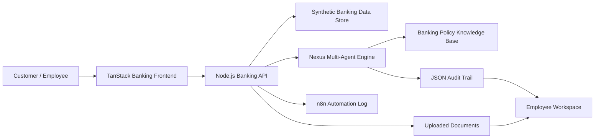

# Nexus AI VoiceOps

An autonomous banking operations demo that combines a premium customer portal, an employee workspace, synthetic banking data, multi-agent decision traces, document upload workflows, audit logs, and n8n-style automation events.

The project is designed for a technical committee demo: the customer sees only safe banking replies, while the employee/admin workspace shows the internal agent pipeline, request handling, evidence, documents, decisions, and audit trail.

## Run With One Link

On Windows, double-click:

```text
RUN_NEXUS_ONE_LINK.bat
```

Then open:

```text
http://localhost:4173/login
```

The backend starts on `4173` and serves the frontend through the same URL. The frontend dev server is used internally only.

## What This Demonstrates

- Role-based entry: Customer Portal and Employee Workspace.
- Arabic and English banking UI.
- Customer-safe answers separated from internal AI reasoning.
- Multi-agent orchestration: Orchestrator, Policy, Credit Risk, Fraud, Compliance, Payroll Ops, Customer Safety, Evaluator.
- Synthetic bank customers, accounts, payroll records, KYC records, loan applications, cards, beneficiaries, and transactions.
- Service request workflow from customer to employee inbox.
- Loan document upload with view/download support in employee workspace.
- AI trace, event timeline, agent pipeline, and audit trail for explainability.
- n8n-style automation run logs for operational events.
- One-link local demo suitable for GitHub download and committee inspection.

## Architecture



## Repository Structure

```text
01_Backend_Node_API
  server.js
  data
  public

02_Frontend_Banking_UI
  src/routes
  src/components
  src/lib

docs
  ARCHITECTURE_AR.md
  API_CONTRACT.md
  DEMO_SCRIPT_AR.md
  STUDENT_WORK_LOG_AR.md

RUN_NEXUS_ONE_LINK.bat
00_README_FIRST.md
```

## Main Endpoints

- `GET /api/state`
- `POST /api/analyze`
- `POST /api/service-requests`
- `POST /api/service-requests/documents`
- `POST /api/service-requests/decision`
- `GET /api/documents/:documentId/view`
- `GET /api/documents/:documentId/download`
- `POST /api/tickets`
- `POST /api/approve`
- `GET /api/evaluations/agents`

More detail is available in [docs/API_CONTRACT.md](docs/API_CONTRACT.md).

## Demo Guidance

Start with the Customer Portal, submit a loan or salary request, upload a document if requested, then switch to Employee Workspace to show the request inbox, documents, agent answers, decision status, and audit trace.

For the full presentation path, see [docs/DEMO_SCRIPT_AR.md](docs/DEMO_SCRIPT_AR.md).

## Important Security Note

This project uses synthetic demo data only. Do not commit real banking data, real customer documents, or real API keys. Put local secrets in `.env` only.
