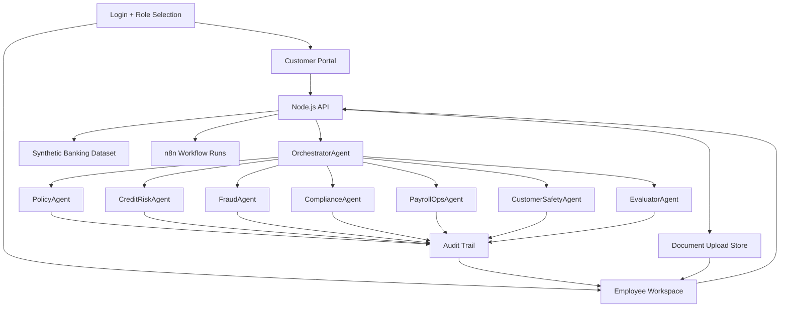

# المعمارية التقنية - Nexus AI VoiceOps

## الهدف

تحويل الاستفسارات البنكية من نص أو صوت إلى طلب تشغيلي قابل للتتبع، مع إجابة آمنة للعميل وشرح كامل للموظف.

## الطبقات



## Frontend

الواجهة مبنية كـ TanStack banking UI وتحتوي:

- صفحة Login بتصميم مصرفي حديث.
- Customer Portal يعرض الخدمات والطلبات وردود البنك.
- Employee Workspace يعرض الطلبات، الوكلاء، audit، automations، committee view.
- RTL support للغة العربية.
- عرض مستندات العميل داخل طلب الموظف.

## Backend

ملف `server.js` يحتوي:

- API endpoints.
- قراءة وكتابة بيانات sandbox.
- تحليل الطلبات.
- تشغيل agent pipeline.
- إنشاء service requests.
- رفع وربط المستندات.
- قرارات الموظف.
- audit logs.
- proxy للواجهة حتى يعمل المشروع على رابط واحد.

## Data Layer

البيانات موجودة داخل:

```text
01_Backend_Node_API/data
```

وتشمل:

- users
- customers
- payrollRecords
- bankAccounts
- transactions
- loanApplications
- cards
- kycProfiles
- beneficiaries
- customerDocuments
- serviceRequests
- documentUploads
- n8nWorkflowRuns
- auditLogs

## Governance

النظام يحافظ على 3 مبادئ:

- Security: لا يعرض معلومات داخلية للعميل.
- Traceability: كل قرار له auditId و route و agent reports.
- Explainability: الموظف يرى سبب القرار والسياسة المرتبطة.

## لماذا هذه المعمارية مناسبة للبنوك؟

لأنها لا تفترض أن الذكاء الاصطناعي يتخذ قرارات نهائية وحده. القرارات الحساسة تمر عبر EvaluatorAgent وقد تتحول إلى human review. هذا مناسب للامتثال، المخاطر، والتدقيق.
